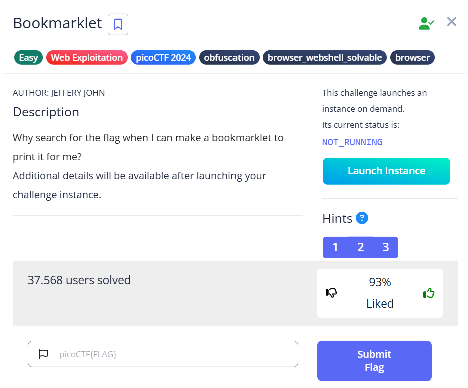
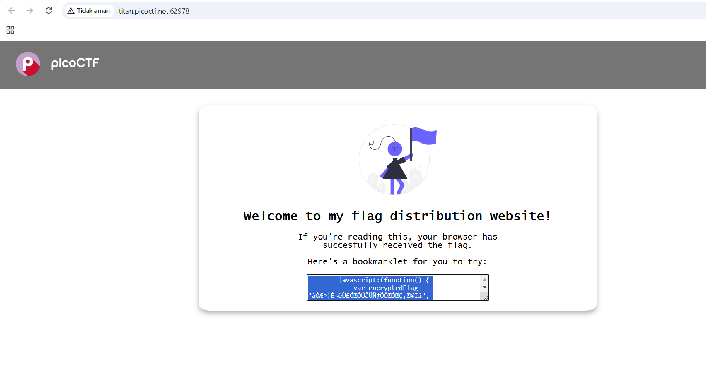
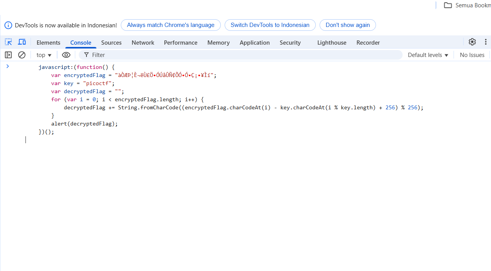

# Bookmarklet

- Link : https://play.picoctf.org/practice/challenge/406?category=1&page=1

## Tantangan

## Penyelesaian
Buka URL : http://titan.picoctf.net:62978/

- Kita bisa copy code yang tertera di web tersebut, disini kita bisa inspect `CTRL+SHIFT+C` dan membuka console untuk menjalankan code tersebut

- Disini kita tekan `Enter` dan kita mendapatkan flagnya!

``
picoCTF{p@g3_turn3r_0c0d211f}
``
