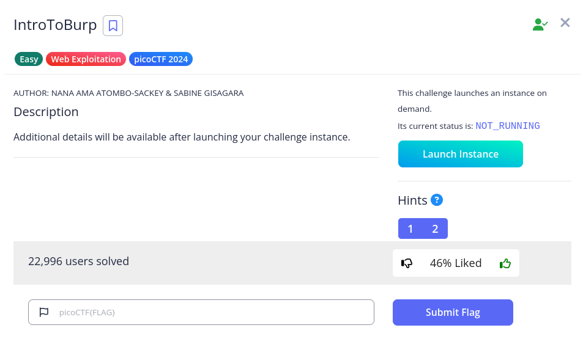
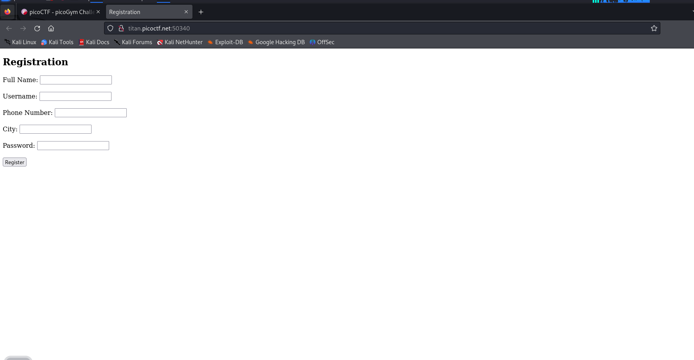
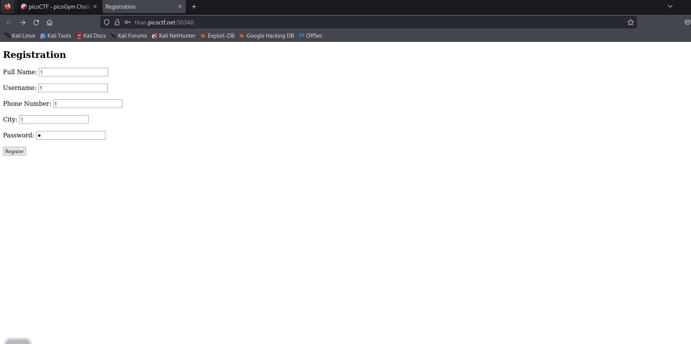
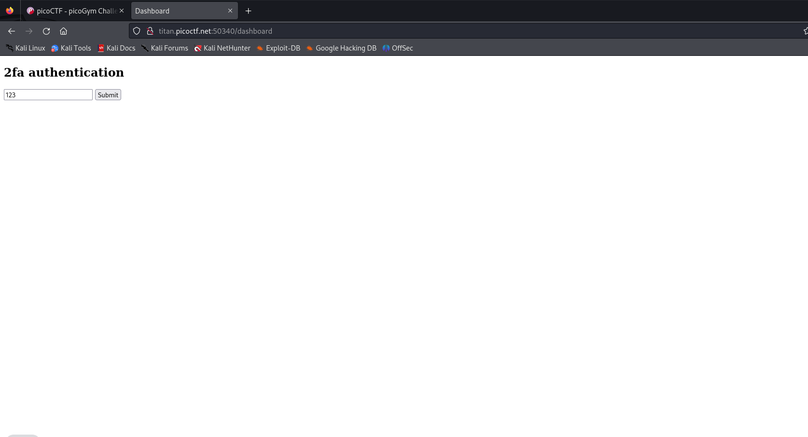
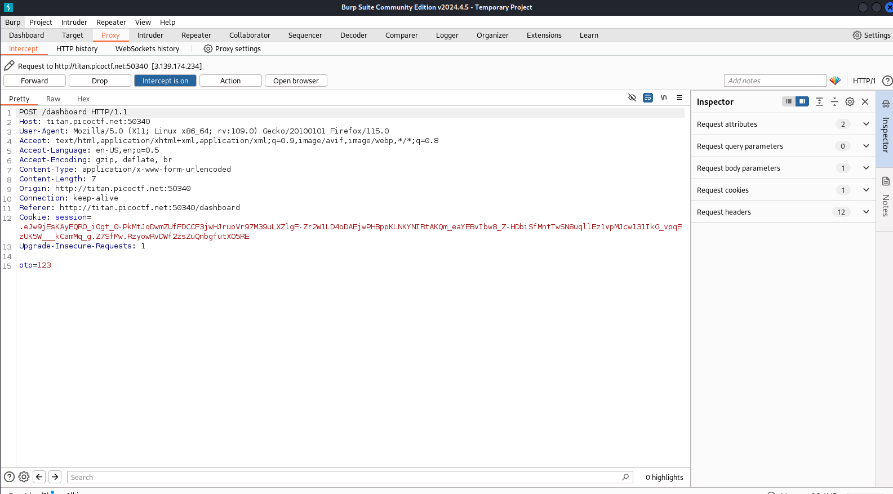
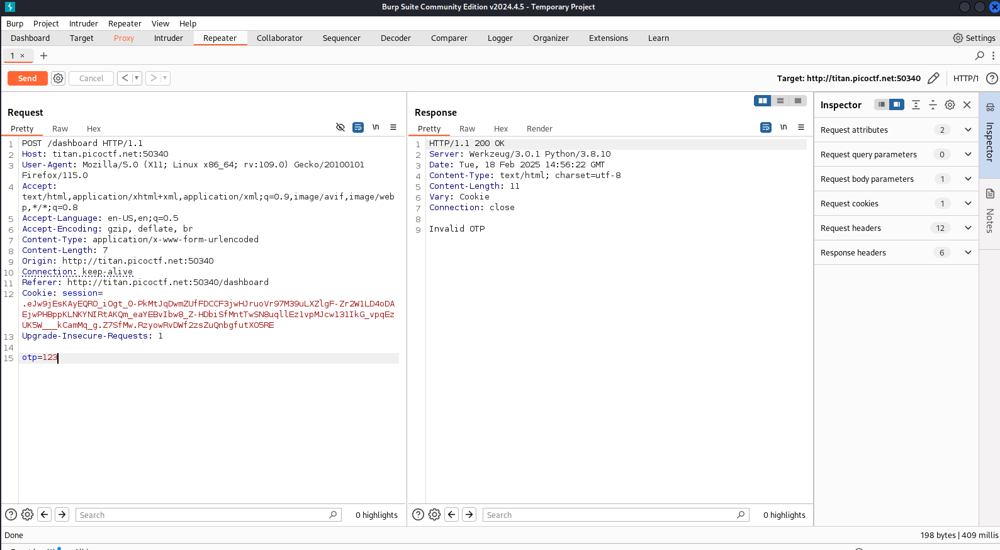
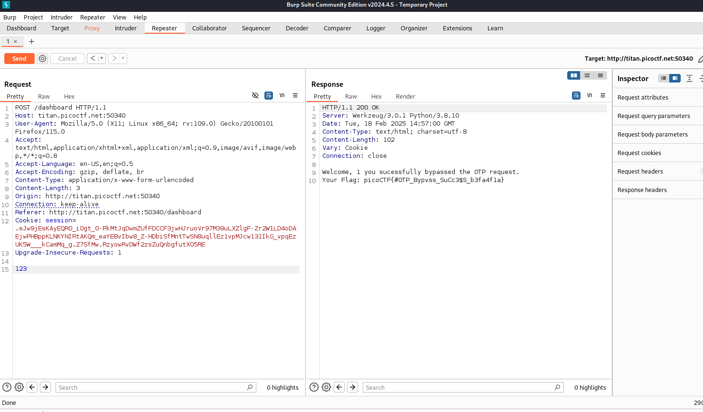

# IntroToBurp

Link : https://play.picoctf.org/practice/challenge/419?category=1&page=1

## Tantangan

## Penyelesaian

Buka URL : http://titan.picoctf.net:50340/

- Disini ketika melihat form ketika pertama kali membuka urlnya

- Kita coba input saja dengan `1` semua lalu register

- Nah ketika kita register disini muncul halaman 2fa authentication, disini kita mencoba untuk mencegat pesan yang lewat dengan burp suite, jika sudah mengaktifkan burpsuite kita bisa langsung submit saja

- Saat berfokus pada /dashboard terdapat permintaan POST, terlihat kode OTP yang mungkin bisa di ubah terlebih dahulu kita send ke repeater dengan `CTRL+R`

- Sekarang kita berada di repeater, dan perhatikan dibawah pada `otp=123` saat kita send menggunakan request ini HTTP menyatakan 200 OK tetapi dibawah terdapat pesan `Invalid OTP` Ini menunjukkan bahwa server tidak memvalidasi input OTP dengan benar, karena mengizinkan input non-numerik tanpa kesalahan.

- Lalu disini saya mencoba untuk menghapus `otp=` dan mencoba send kembali, dan yap kita mendapatkan flagnya

`picoCTF{#0TP_Bypvss_SuCc3$S_b3fa4f1a}`
